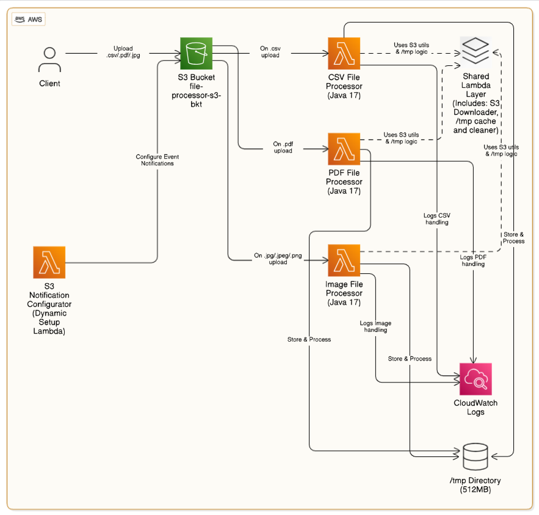

# Serverless S3 File Processor using Shared Lambda layer and AWS SAM


In modern cloud-native applications, handling diverse file types uploaded to Amazon S3 is a common requirement — especially in data pipelines, content ingestion systems, and document automation workflows. However, building such a solution in a scalable, modular, and maintainable way can be challenging due to code duplication, event handling complexities, and deployment pitfalls like circular dependencies.

This project addresses that challenge by implementing a **serverless, multi-format file processing framework** using **Lambda Layer**, **AWS Lambda using Java 17**, and **AWS SAM**. It is designed to automatically detect and process different file types — such as **CSV**, **PDF**, and **Images** — uploaded to an S3 bucket using a clean, layered architecture.

---

## Purpose of the Project

The core goals of this project are:

- **Simplify and modularize file processing** across different formats using dedicated Lambda functions.
- **Promote reusability** through a shared Lambda Layer for common S3 operations like downloading and local caching.
- **Resolve circular dependency issues** during CloudFormation deployment by dynamically configuring S3 event notifications using a **custom resource Lambda**.
- Provide a ready-to-use, extensible template for teams or individuals building scalable serverless file handling solutions on AWS.

---

## Core Components

- **Shared Lambda Layer**: Centralizes file handling logic (S3 download ➝ `/tmp` caching ➝ cleanup).
- **CSVFileProcessor / PDFFileProcessor / ImageFileProcessor**: Individual Lambda functions that process specific file types.
- **S3NotificationConfigurator Lambda**: A deployment-time helper function that programmatically sets up S3 event notifications to avoid SAM circular reference errors.

This project demonstrates how to build **production-ready**, event-driven architectures with **separation of concerns**, **clean code practices**, and **operational efficiency** in mind.

---

## Repository Structure

```

.
├── shared-lambda-layer/                  # Common utility logic (download/cache from S3)
│   ├── pom.xml
│   └── src/main/java/
│       └── s3fileutil/
│           └── FileHandler.java
├── csv-file-processor/                  # Lambda for processing CSV files
│   ├── pom.xml
│   └── src/main/java/
│       └── CsvFileProcessor.java
├── pdf-file-processor/                  # Lambda for processing PDF files
│   ├── pom.xml
│   └── src/main/java/
│       └── PdfFileProcessor.java
├── image-file-processor/                # Lambda for processing image files
│   ├── pom.xml
│   └── src/main/java/
│       └── ImageFileProcessor.java
├── s3-notification-configurator/        # Lambda to dynamically add S3 bucket event notifications
│   ├── pom.xml
│   └── src/main/java/
│       └── S3NotificationConfigurator.java
├── template.yaml                        # AWS SAM infrastructure definition
├── samconfig.toml                       # SAM CLI configuration
└── pom.xml                              # Parent Maven project configuration

````

---

## Usage Instructions

### Prerequisites

- Java Development Kit (JDK) 17 or later
- Apache Maven 3.8.x or later
- AWS SAM CLI
- AWS CLI configured with necessary permissions
- AWS account with access to create:
  - Lambda functions
  - S3 buckets and notifications
  - IAM roles and policies
  - CloudFormation Custom Resources

---

### Installation

```bash
git clone <repository-url>
cd multi-type-s3-file-processor-using-lambda-layer
mvn clean package
sam build
sam deploy --guided
````

During guided deployment:

* Confirm the stack name (default: `multi-type-s3-file-processor-using-lambda-layer`)
* Select your AWS region
* Allow SAM to create IAM roles
* Provide your S3 bucket name for file uploads
* Accept changes and deploy

---

##  Quick Start

### Upload a File

Upload a test file to the configured S3 bucket:

```bash
aws s3 cp sample.csv s3://<BUCKET_NAME>/input/sample.csv
```

The system will automatically:

1. Detect the file type.
2. Trigger the appropriate processor Lambda (CSV, PDF, Image).
3. Download the file via the shared layer into `/tmp`.
4. Process and log the output.

---

## Test Scenarios

### Test CSV Processing

```bash
aws s3 cp test-data/sample.csv s3://<BUCKET_NAME>/input/sample.csv
```

### Test PDF Processing

```bash
aws s3 cp test-data/sample.pdf s3://<BUCKET_NAME>/input/sample.pdf
```

### Test Image Processing

```bash
aws s3 cp test-data/sample.jpg s3://<BUCKET_NAME>/input/sample.jpg
```

Monitor logs for the appropriate function via CloudWatch.

---

## Architecture Diagram



---

## Data Flow

```
                          [S3 Bucket]
                               │
           ┌───────────────────┴──────────────────────┐
           │                   │                      │
     (File: .csv)         (File: .pdf)       (File: .jpg /.png /.jpeg)
           ▼                   ▼                      ▼
 [CSVFileProcessor]      [PDFProcessor]       [ImageProcessor]
           │                   │                      │
           ▼                   ▼                      ▼
          ┌───────────────────────────────────────────┐
                               │
                               ▼ 
            [Shared Lambda Layer: FileHandler.java]
                               │
                               ▼
                    [Download and Cache to /tmp]
                               │
                               ▼
                       [Process & Complete]
```

---

##  Component Interactions

1. User uploads a file to an S3 bucket.
2. S3 triggers the corresponding Lambda processor based on suffix.
3. The Lambda:

    * Calls a method from the **shared layer** to download the file from S3.
    * Caches it to the `/tmp` directory.
    * Processes it according to its type.
4. Results are logged or sent to a downstream service (future scope).

---

## Infrastructure Details

Infrastructure is defined using **AWS SAM** and includes:

* **Lambda Functions:**

    * `CSVFileProcessorFunction`
    * `PDFFileProcessorFunction`
    * `ImageFileProcessorFunction`
    * `S3NotificationConfiguratorFunction` (Custom Resource)

* **Shared Lambda Layer:**

    * Provides common file handling logic

* **S3 Bucket:**

    * Stores uploaded files
    * Configured with dynamic notifications using Custom Resource

* **IAM Roles:**

    * Minimum required permissions to access S3, write logs, and manage events

---
##  Known Limitations

- Files larger than ~250MB may exceed the Lambda `/tmp` size limit.
- This project currently logs output to CloudWatch; downstream integration is a future enhancement.
- Suffix-based routing assumes correct file extensions; content-type checks can be added for robustness.

---

## Troubleshooting

### Lambda Layer Not Found

Ensure the layer is built correctly and referenced in each function’s `Layers` property in `template.yaml`.

###  View Logs

```bash
aws logs describe-log-groups
aws logs get-log-events \
  --log-group-name /aws/lambda/CSVFileProcessorFunction \
  --log-stream-name <latest-stream>
```

---
